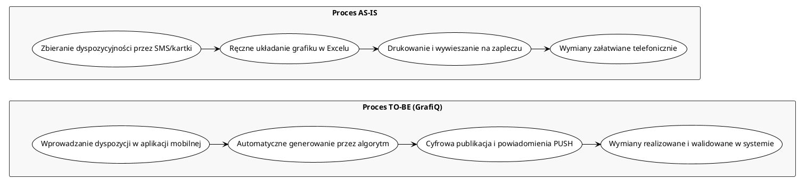
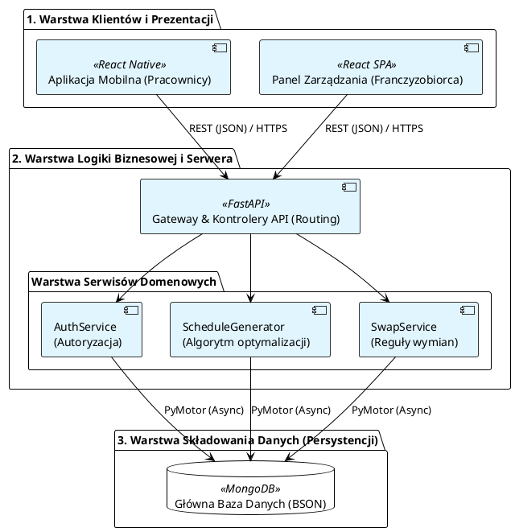
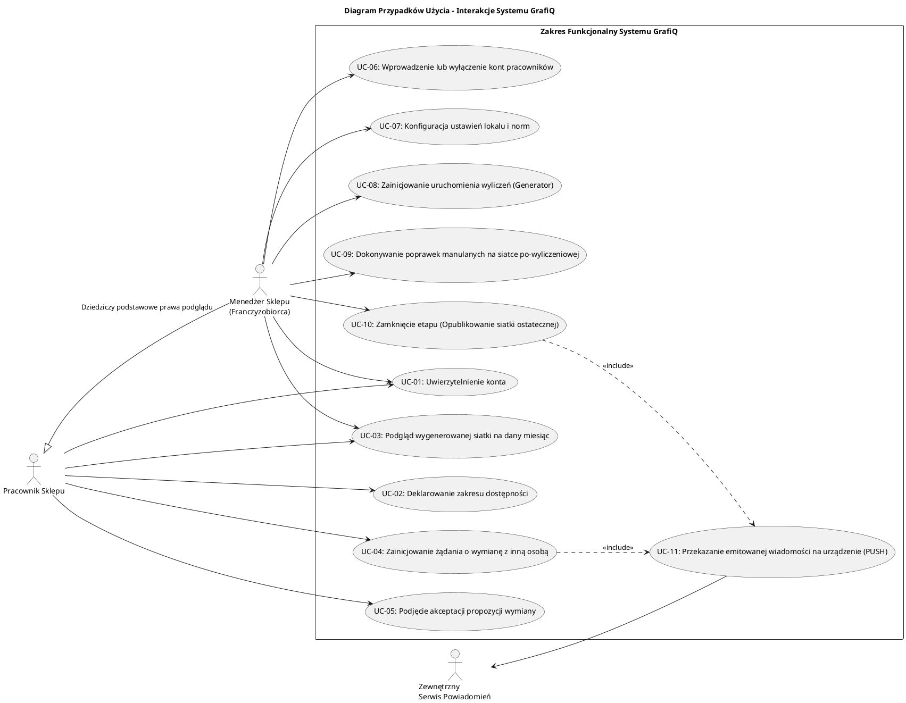
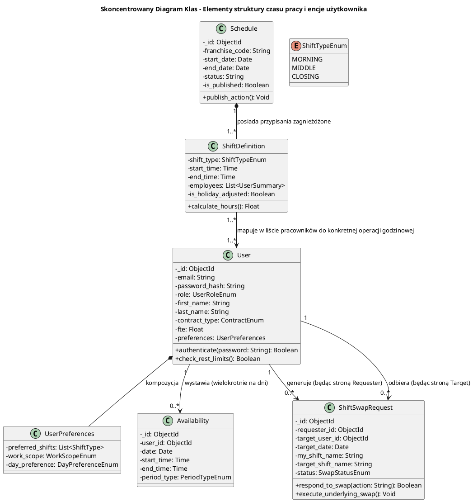
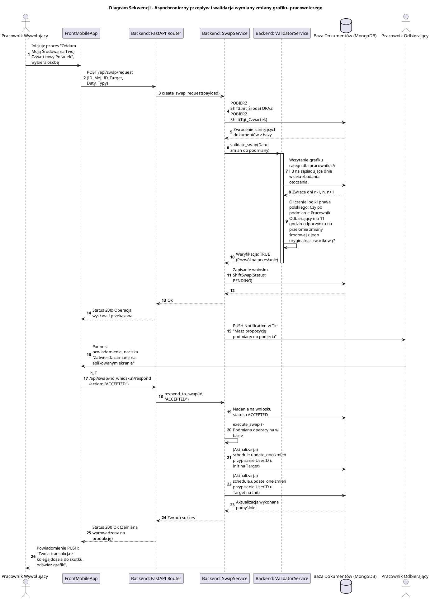

# PROJEKT SYSTEMU INFORMATYCZNEGO "GrafiQ"

<br>
<br>
<br>

## UNIWERSYTET WSB MERITO GDAŃSK
### Wydział Inżynierii

<br>

**Kierunek:** Informatyka inżynierska
**Specjalność:** Projektowanie Systemów Informatycznych

<br>
<br>

**Temat projektu:**
System do inteligentnego zarządzania i automatyzacji grafików pracy w sieciach franczyzowych

<br>
<br>
<br>
<br>
<br>

**Autor:** Krzysztof Janik
**Numer albumu:** 66615
**Semestr:** 5
**Grupa:** ININ5 PR1.1

<br>
<br>
<br>

**Gdańsk, 2024**

---

## Spis Treści
1. [Wprowadzenie](#rozdział-1-wprowadzenie)
    1. [Cel projektu](#11-cel-projektu)
    2. [Zakres projektu](#12-zakres-projektu)
    3. [Słownik pojęć, definicje i skróty](#13-słownik-pojęć-definicje-i-skróty)
2. [Analiza problemu biznesowego](#rozdział-2-analiza-problemu-biznesowego)
    1. [Charakterystyka organizacji](#21-charakterystyka-organizacji)
    2. [Identyfikacja interesariuszy](#22-identyfikacja-interesariuszy)
    3. [Analiza procesów biznesowych (AS-IS i TO-BE)](#23-analiza-procesów-biznesowych-as-is-i-to-be)
3. [Specyfikacja Wymagań Systemowych (SRS)](#rozdział-3-specyfikacja-wymagań-systemowych-srs)
    1. [Wymagania funkcjonalne](#31-wymagania-funkcjonalne)
    2. [Wymagania niefunkcjonalne](#32-wymagania-niefunkcjonalne)
    3. [Priorytetyzacja wymagań (MoSCoW)](#33-priorytetyzacja-wymagań-moscow)
    4. [Macierz identyfikowalności wymagań (RTM)](#34-macierz-identyfikowalności-wymagań-rtm)
4. [Architektura Systemu](#rozdział-4-architektura-systemu)
    1. [Uzasadnienie wyboru architektury](#41-uzasadnienie-wyboru-architektury)
    2. [Architektura warstwowa](#42-architektura-warstwowa)
    3. [Skalowalność, bezpieczeństwo i utrzymanie](#43-skalowalność-bezpieczeństwo-i-utrzymanie)
5. [Modelowanie Systemu](#rozdział-5-modelowanie-systemu)
    1. [Model C4](#51-model-c4)
    2. [Diagramy UML](#52-diagramy-uml)
    3. [Modelowanie procesów biznesowych (BPMN)](#53-modelowanie-procesów-biznesowych-bpmn)
6. [Projekt Bazy Danych](#rozdział-6-projekt-bazy-danych)
    1. [Model encji i relacji (ERD)](#61-model-encji-i-relacji-erd)
    2. [Proces normalizacji](#62-proces-normalizacji)
    3. [Struktura tabel i relacji](#63-struktura-tabel-i-relacji)
7. [Bezpieczeństwo i Analiza Ryzyka](#rozdział-7-bezpieczeństwo-i-analiza-ryzyka)
    1. [Model uwierzytelniania i autoryzacji](#71-model-uwierzytelniania-i-autoryzacji)
    2. [Analiza ryzyka (ISO 27005 i STRIDE)](#72-analiza-ryzyka-iso-27005-i-stride)
8. [Plan Testów](#rozdział-8-plan-testów)
    1. [Strategia testowania](#81-strategia-testowania)
    2. [Scenariusze testowe](#82-scenariusze-testowe)
9. [Wdrożenie i Utrzymanie](#rozdział-9-wdrożenie-i-utrzymanie)
    1. [Środowisko wdrożeniowe i CI/CD](#91-środowisko-wdrożeniowe-i-cicd)
    2. [Monitoring i plan odzyskiwania po awarii (DRP)](#92-monitoring-i-plan-odzyskiwania-po-awarii-drp)
10. [Podsumowanie](#rozdział-10-podsumowanie)
11. [Bibliografia](#rozdział-11-bibliografia)

---

## Rozdział 1: Wprowadzenie

### 1.1. Cel projektu
Celem projektu "GrafiQ" jest zaprojektowanie, implementacja i wdrożenie zaawansowanego systemu informatycznego klasy WFM (Workforce Management), dedykowanego dla sieci franczyzowych. Głównym założeniem jest automatyzacja i optymalizacja procesu tworzenia grafików pracy, z uwzględnieniem złożonych czynników, takich jak przepisy prawa pracy, indywidualne preferencje pracowników, zapotrzebowanie kadrowe w placówkach oraz dynamiczne zdarzenia (np. urlopy, zwolnienia lekarskie, wymiany zmian). System ma na celu zminimalizowanie czasochłonności i błędów związanych z ręcznym planowaniem, zapewnienie zgodności z regulacjami prawnymi oraz zwiększenie satysfakcji pracowników poprzez elastyczne zarządzanie ich dostępnością.

### 1.2. Zakres projektu
**System realizuje następujące funkcjonalności:**
*   Zarządzanie profilami użytkowników (Franczyzobiorca, Pracownik) i ich danymi kontraktowymi (etat, umowa, preferencje, wymiar godzin).
*   Składanie i zarządzanie dyspozycyjnością przez pracowników za pośrednictwem aplikacji mobilnej (określanie godzin i typów zmian).
*   Automatyczne generowanie optymalnych grafików pracy na podstawie zdefiniowanych reguł (hard constraints: przepisy prawa, minimalne obsady) oraz preferencji (soft constraints).
*   Zarządzanie opublikowanym grafikiem, w tym wprowadzanie ręcznych korekt przez franczyzobiorcę.
*   Obsługa wniosków urlopowych i zwolnień lekarskich (L4) z automatycznym uwzględnieniem w grafiku.
*   Funkcjonalność wnioskowania i akceptacji wymiany zmian między pracownikami z automatyczną weryfikacją poprawności (np. czas odpoczynku).
*   System powiadomień push oraz e-mail o kluczowych zdarzeniach (nowy grafik, prośba o wymianę, akceptacja urlopu).
*   Generowanie podstawowych raportów dotyczących czasu pracy i absencji.

**Projekt nie obejmuje:**
*   Modułu rekrutacyjnego i onboardingu nowych pracowników.
*   Bezpośredniej integracji z zewnętrznymi systemami kadrowo-płacowymi (choć architektura umożliwia to w przyszłości poprzez API).
*   Zaawansowanej analityki biznesowej (BI) i prognozowania zapotrzebowania na personel w oparciu o modele uczenia maszynowego lub dane sprzedażowe POS.
*   Modułu rozliczania czasu pracy (RCP) z czytnikami biometrycznymi i naliczania finalnych wynagrodzeń.

### 1.3. Słownik pojęć, definicje i skróty

*Tabela 1: Słownik pojęć i skrótów*

| Skrót/Pojęcie | Definicja |
| :--- | :--- |
| **GrafiQ** | Nazwa własna projektowanego systemu informatycznego służącego do zarządzania czasem pracy. |
| **Franczyzobiorca** | Użytkownik systemu o podwyższonych uprawnieniach, zarządzający jedną lub wieloma placówkami, odpowiedzialny za tworzenie i publikację grafików oraz weryfikację wniosków. |
| **Pracownik** | Użytkownik końcowy systemu, pracujący w danej placówce, korzystający z aplikacji mobilnej do zgłaszania dyspozycyjności, sprawdzania grafiku i wnioskowania o wymiany/urlopy. |
| **Dyspozycyjność** | Deklaracja pracownika określająca jego dostępność do pracy (dni, godziny, preferowane typy zmian) w danym okresie rozliczeniowym. |
| **Zmiana** | Zdefiniowany, ciągły blok czasowy pracy w grafiku (np. poranna, zamykająca), przypisany do konkretnego pracownika w danym dniu. |
| **SRS** | Software Requirements Specification (Specyfikacja Wymagań Systemowych) - dokument definiujący oczekiwane zachowanie systemu. |
| **UML** | Unified Modeling Language (Zunifikowany Język Modelowania) - standardowy język modelowania obiektowego. |
| **BPMN** | Business Process Model and Notation (Notacja i Model Procesu Biznesowego) - notacja graficzna do opisywania procesów biznesowych. |
| **C4 Model** | Context, Containers, Components, and Code - hierarchiczny model do wizualizacji architektury oprogramowania. |
| **ERD** | Entity-Relationship Diagram (Diagram Związków Encji) - graficzna reprezentacja modelu danych i relacji między nimi. |
| **API** | Application Programming Interface (Interfejs Programowania Aplikacji) - zbiór reguł definiujących komunikację między komponentami systemu. |
| **CI/CD** | Continuous Integration / Continuous Deployment (Ciągła Integracja / Ciągłe Wdrażanie) - praktyka automatyzacji budowania, testowania i wdrażania oprogramowania. |
| **DRP** | Disaster Recovery Plan (Plan Odzyskiwania po Awarii) - zbiór procedur określających przywracanie działania systemu po poważnej awarii. |
| **RTM** | Requirements Traceability Matrix (Macierz Identyfikowalności Wymagań) - narzędzie służące do śledzenia powiązań między wymaganiami a innymi elementami projektu (np. testami, kodem). |
| **MoSCoW** | Metoda priorytetyzacji wymagań dzieląca je na kategorie: Must have, Should have, Could have, Won't have. |
| **STRIDE** | Model klasyfikacji zagrożeń bezpieczeństwa (Spoofing, Tampering, Repudiation, Information Disclosure, Denial of Service, Elevation of Privilege). |

---

## Rozdział 2: Analiza problemu biznesowego

### 2.1. Charakterystyka organizacji
Organizacja docelowa, dla której projektowany jest system GrafiQ, to dynamicznie rozwijająca się sieć franczyzowa z branży handlu detalicznego. Sieć składa się z centrali zarządzającej standardami marki oraz licznych, rozproszonych geograficznie placówek handlowych prowadzonych przez niezależnych przedsiębiorców (franczyzobiorców). Każda placówka, w zależności od wielkości i lokalizacji, zatrudnia od kilku do kilkudziesięciu pracowników. Zróżnicowanie form zatrudnienia (umowy o pracę, umowy cywilnoprawne - np. zlecenie), różnorodne wymiary etatów (pełny, część etatu) oraz rotacja personelu stanowią istotne wyzwanie operacyjne. Choć centrala narzuca wytyczne dotyczące godzin otwarcia i minimalnej obsługi, to na franczyzobiorcach spoczywa wyłączna odpowiedzialność za optymalne ułożenie grafiku, zaspokojenie potrzeb kadrowych i przestrzeganie przepisów prawa pracy.

### 2.2. Identyfikacja interesariuszy

*Tabela 2: Zestawienie interesariuszy projektu*

| Lp. | Interesariusz | Typ | Rola i Oczekiwania wobec systemu |
| :-- | :--- | :--- | :--- |
| 1. | **Franczyzobiorca** | Wewnętrzny (Kluczowy) | Zarządza placówką(ami) i personelem. Oczekuje radykalnego skrócenia czasu tworzenia grafiku poprzez jego automatyzację. Wymaga mechanizmów walidacji chroniących przed złamaniem prawa pracy (np. brak 11-godzinnego odpoczynku). Oczekuje przejrzystego interfejsu webowego do zarządzania zespołem i weryfikacji wniosków. |
| 2. | **Pracownik sklepu** | Wewnętrzny (Kluczowy) | Bezpośredni wykonawca pracy. Oczekuje intuicyjnej i zawsze dostępnej aplikacji mobilnej. Zależy mu na łatwym sposobie zgłaszania dyspozycyjności z wyprzedzeniem, szybkim dostępie do opublikowanego grafiku oraz prostej procedurze wnioskowania o urlopy i wymiany zmian z innymi pracownikami, bez konieczności bezpośredniego kontaktu z przełożonym. |
| 3. | **Centrala sieci** | Zewnętrzny | Narzuca standardy i wizerunek. W przyszłości może oczekiwać od systemu raportów zagregowanych i integracji z systemami centralnymi, jednak w obecnej iteracji jej bezpośredni wpływ ogranicza się do zdefiniowania ram biznesowych działalności punktów. Oczekuje profesjonalizacji zarządzania w placówkach. |
| 4. | **Administrator Systemu (DevOps)** | Wewnętrzny | Odpowiada za wdrożenie, utrzymanie i stabilność środowiska produkcyjnego. Oczekuje systemu łatwego w monitorowaniu, posiadającego czytelne logi aplikacyjne, obsługującego automatyczne wdrażanie (CI/CD) oraz pozwalającego na skalowanie w chmurze (np. konteneryzacja Docker). |
| 5. | **Zespół Deweloperski** | Wewnętrzny | Twórcy oprogramowania. Oczekują jasnych, nietuzinkowych wymagań (SRS), dobrze zdefiniowanej, modularnej architektury ułatwiającej równoległą pracę oraz jednoznacznego podziału odpowiedzialności między backendem (FastAPI) a frontendem (React/React Native). |

### 2.3. Analiza procesów biznesowych (AS-IS i TO-BE)

**Proces AS-IS (stan obecny): "Manualne tworzenie i obsługa grafiku pracy"**
Większość punktów franczyzowych realizuje ten proces analogowo lub przy użyciu podstawowych narzędzi (MS Excel). Proces rozpoczyna się od próby zebrania dyspozycyjności. Franczyzobiorca wysyła komunikaty (często grupowo przez komunikatory typu WhatsApp/Messenger) z prośbą o podanie dostępności. Informacje spływają chaotycznie, w różnych formatach i czasie. Następnie menedżer, używając arkusza, próbuje ręcznie dopasować pracowników do wymaganych zmian (rano, popołudnie, zamknięcie), biorąc pod uwagę ich umowy, normy godzinowe i prośby. Proces ten jest niezwykle podatny na błędy ludzkie (np. nieumyślne zaplanowanie pracownika bez wymaganego ustawowo 11-godzinnego odpoczynku między dobami pracowniczymi). Gotowy grafik jest drukowany, wywieszany na zapleczu i/lub wysyłany zdjęciem na grupę. Wszelkie absencje (L4) lub prośby o wymiany wymagają ręcznej interwencji, ponownego wydruku i komunikacji, generując chaos informacyjny.

**Proces TO-BE (stan docelowy): "Zautomatyzowane zarządzanie w środowisku GrafiQ"**
Wdrażany system GrafiQ rewolucjonizuje i cyfryzuje ten proces. Zbieranie dyspozycyjności odbywa się strukturyzowanie – pracownicy w wyznaczonym terminie wprowadzają dane (godziny od-do, preferencje) bezpośrednio w aplikacji mobilnej. Gdy nadchodzi czas utworzenia grafiku, franczyzobiorca uruchamia algorytm w panelu webowym. System GrafiQ agreguje dyspozycje, analizuje zapotrzebowanie zdefiniowane w ustawieniach sklepu, weryfikuje twarde reguły prawa pracy (wymiar etatu, odpoczynki) oraz miękkie preferencje pracowników. Wynikiem jest zoptymalizowany projekt grafiku wygenerowany w kilkadziesiąt sekund. Po ewentualnych korektach i zatwierdzeniu przez menedżera, grafik jest automatycznie publikowany. Pracownicy natychmiast otrzymują powiadomienia PUSH i widzą zaktualizowany kalendarz pracy w swoich telefonach. Wnioski o wymianę zmian obsługiwane są asynchronicznie – pracownik A proponuje zmianę, pracownik B akceptuje, system (po walidacji reguł) automatycznie aktualizuje bazę i powiadamia zainteresowanych, zdejmując ten obowiązek z przełożonego.

*Rysunek 1: Diagram procesów biznesowych AS-IS vs TO-BE (uproszczony)*


---

## Rozdział 3: Specyfikacja Wymagań Systemowych (SRS)

### 3.1. Wymagania funkcjonalne
Wymagania zdefiniowano zgodnie z metodyką SMART (Skonkretyzowane, Mierzalne, Osiągalne, Istotne, Określone w czasie).

*Tabela 3: Lista wymagań funkcjonalnych*

| ID | Nazwa | Opis (SMART) |
| :--- | :--- | :--- |
| **FR-AUTH-001** | Bezpieczne logowanie użytkowników | System musi bezwzględnie weryfikować tożsamość każdego użytkownika (Pracownika i Franczyzobiorcy) podającego poprawny e-mail i hasło podczas próby dostępu. Proces autoryzacji zakończy się wygenerowaniem podpisanego tokena JWT z określonym czasem ważności. |
| **FR-USR-001** | Zarządzanie kontami personelu | Franczyzobiorca musi mieć dedykowany moduł pozwalający na dodanie nowego pracownika, zdefiniowanie jego danych (imię, nazwisko, typ umowy - np. UOP/UZ, ułamek etatu) oraz późniejszą edycję lub zawieszenie tego konta w panelu webowym. |
| **FR-AV-001** | Raportowanie dyspozycyjności | Każdy zalogowany pracownik musi mieć możliwość określenia w aplikacji mobilnej swojej dostępności (zakres godzin, np. 08:00-16:00 lub typ zmiany np. "rano", "niedostępny") na wskazane dni kalendarzowe w przód, a system musi trwale zapisać ten stan w bazie. |
| **FR-SCH-001** | Konfiguracja parametrów zapotrzebowania | System musi pozwolić franczyzobiorcy na wprowadzenie i zapisanie w panelu webowym wymaganej, minimalnej liczby pracowników dla każdego definiowanego typu zmiany (np. "Poranna: 2, Środkowa: 0, Zamykająca: 1"). |
| **FR-GEN-001** | Algorytmiczne układanie grafiku | System musi udostępniać mechanizm generujący pełny plan pracy dla całego sklepu na zadany okres (np. miesiąc kalendarzowy), przydzielający automatycznie pracowników do zmian tak, aby spełnić zdefiniowane zapotrzebowanie (FR-SCH-001) uwzględniając bazę dyspozycyjności (FR-AV-001). |
| **FR-VAL-001** | Automatyczna walidacja czasu odpoczynku | W trakcie działania generatora (FR-GEN-001) oraz przy każdej ręcznej modyfikacji, system nie może dopuścić do sytuacji, w której zaplanowany czas pomiędzy zakończeniem jednej zmiany a rozpoczęciem kolejnej dla tego samego pracownika wyniesie poniżej wymaganych prawem 11 godzin kalendarzowych. |
| **FR-PUB-001** | Dystrybucja i publikacja planu | Franczyzobiorca, po zweryfikowaniu wygenerowanego projektu, musi mieć możliwość zatwierdzenia go pojedynczą akcją (np. przycisk "Publikuj"). System musi natychmiast udostępnić ostateczną wersję widoku grafiku w interfejsach pracowników (aplikacja mobilna). |
| **FR-SWAP-001** | Zgłaszanie ofert wymiany zmian | Pracownik posiadający opublikowaną zmianę w przyszłości musi mieć możliwość wygenerowania systemowej prośby o zastępstwo kierowanej do konkretnego pracownika (wybór z listy), określając, którą ze swoich zmian oddaje, a którą (opcjonalnie) chce objąć w zamian. |
| **FR-SWAP-002** | Akceptacja wymiany z weryfikacją | Pracownik odbierający ofertę z FR-SWAP-001 musi mieć możliwość akceptacji tej prośby w aplikacji. Po naciśnięciu "Akceptuj", system przed finalizacją musi zweryfikować dostępność i limity (np. regułę 11h) – jeśli są zachowane, zamiana miejsc w bazie danych musi nastąpić bez ingerencji przełożonego. |
| **FR-NOT-001** | Emisja powiadomień PUSH | System musi być zintegrowany z mechanizmem wysyłki powiadomień mobilnych (np. Firebase Cloud Messaging). Powiadomienia muszą być automatycznie wyzwalane i wysyłane z backendu jako potwierdzenie zdarzeń dla adresatów: "Nowy grafik został opublikowany" (FR-PUB-001) oraz "Otrzymałeś ofertę wymiany" (FR-SWAP-001). |

### 3.2. Wymagania niefunkcjonalne
Określenie atrybutów jakościowych projektowanego systemu.

*Tabela 4: Lista wymagań niefunkcjonalnych*

| ID | Kategoria | Opis | Konkretna Metryka / Kryterium akceptacji |
| :--- | :--- | :--- | :--- |
| **NFR-PERF-001** | Wydajność (Algorytm) | Moduł generowania grafiku musi działać efektywnie i dostarczać wynik bez zjawiska zablokowania interfejsu użytkownika. | Czas całkowitego generowania i walidacji projektu grafiku miesięcznego dla placówki do 20 pracowników nie może przekroczyć **30 sekund**. |
| **NFR-PERF-002** | Wydajność (API) | Zapytania do krytycznych endpointów API REST odczytujących dane z bazy (np. pobieranie grafiku na dany tydzień przez pracownika) muszą być wysoce responsywne. | 95. percentyl (p95) czasu odpowiedzi (latency) dla żądań GET `/api/schedule` przy teście obciążeniowym rzędu 50 równoczesnych requestów musi wynosić **< 500 ms**. |
| **NFR-SEC-001** | Bezpieczeństwo (Kryptografia) | Wrażliwe poświadczenia logowania nie mogą pod żadnym pozorem być przechowywane i przesyłane w otwartym tekście (plain-text) w bazie danych ani w logach. | Aplikacja musi implementować sól (salt) i funkcję haszującą **Bcrypt** dla każdego tworzonego i walidowanego hasła użytkownika, sprawdzane podczas przeglądu kodu. |
| **NFR-REL-001** | Niezawodność (Ciągłość bazy) | Persystencja danych grafików i wymian musi być zapewniona, system musi być w stanie odbudować stan w przypadku awarii węzła sprzętowego. | Zaprojektowana infrastruktura wdrożeniowa bazy (MongoDB) musi korzystać z mechanizmów wdrożenia typu **Replica Set** złożonego minimum z 3 węzłów, zapewniających failover. |
| **NFR-USE-001** | Użyteczność (Mobile) | Główne działania realizowane przez pracowników za pośrednictwem aplikacji mobilnej muszą być wysoce intuicyjne, nie wymagając wcześniejszych szkoleń obsługi. | Badania UAT wykażą, że 9 na 10 nowych użytkowników aplikacji mobilnej jest w stanie zgłosić swoją tygodniową dyspozycyjność bez pomyłek i w czasie poniżej **2 minut** od startu zadania. |

### 3.3. Priorytetyzacja wymagań (MoSCoW)
Technika pozwala zdefiniować zakres prac na poszczególne iteracje rozwoju MVP.

| Priorytet | Wymagania (ID) | Uzasadnienie biznesowe |
| :--- | :--- | :--- |
| **M**ust have (Wymagane) | FR-AUTH-001, FR-USR-001, FR-AV-001, FR-SCH-001, FR-GEN-001, FR-VAL-001, FR-PUB-001, NFR-SEC-001, NFR-REL-001 | Zbiór ten stanowi absolutne "serce" (Core) systemu. Bez uwierzytelnienia, generacji opartej o walidację oraz dostarczania wyników pracownikom, system jest całkowicie bezużyteczny i nie realizuje procesu TO-BE. |
| **S**hould have (Powinno być) | FR-SWAP-001, FR-SWAP-002, FR-NOT-001, NFR-PERF-001, NFR-PERF-002, NFR-USE-001 | Elementy znacząco optymalizujące procesy poboczne. Brak automatycznych wymian wymusza dodatkową pracę menedżera, a brak notyfikacji push spowalnia przepływ wiedzy w zespole. |
| **C**ould have (Mogłoby być) | (Pominięto dedykowane ID ze względu na objętość) Integracja kalendarzy z iCal/Google Calendar, zaawansowane moduły raportowe (eksport wyliczeń przepracowanych godzin do CSV/PDF). | Cechy "Nice-to-have" podnoszące zadowolenie i konkurencyjność na rynku. |
| **W**on't have (Nie będzie w tej wersji) | (Pominięto dedykowane ID) Pełen mechanizm rozliczania wynagrodzeń w oparciu o stawki godzinowe, moduł elektronicznego wbijania na kasę (Clock IN/OUT) z walidacją GPS. | Zbyt wysoki stopień komplikacji, wykraczający poza definicję aplikacji zarządzającej samym harmonogramem pracy, przewidziane na odległe Roadmapy. |

### 3.4. Macierz identyfikowalności wymagań (RTM)

*Tabela 5: Macierz identyfikowalności wymagań (RTM)*

| ID Wymagania | Skrócony Opis | Powiązany Przypadek Użycia (UC) | Odpowiedzialny Komponent Architektury | Przypisany Scenariusz Testowy (TC) |
| :--- | :--- | :--- | :--- | :--- |
| FR-AUTH-001 | Logowanie JWT | UC-01: Logowanie do systemu | API Gateway, AuthService, MongoDB | TC-SEC-01, TC-FUNC-01 |
| FR-USR-001 | Zarządzanie pracownikami | UC-02: Zarządzanie profilem | Web Frontend, UserService, MongoDB | TC-FUNC-02 |
| FR-AV-001 | Raportowanie dyspozycyjności | UC-03: Przesyłanie preferencji | Mobile Frontend, AvailabilityService, MongoDB | TC-FUNC-03 |
| FR-GEN-001 | Generowanie grafiku | UC-04: Tworzenie planu | ScheduleGeneratorService, ScheduleService | TC-FUNC-04, TC-PERF-01 |
| FR-VAL-001 | Walidacja reguły 11h | UC-04: Tworzenie planu; UC-06: Wymiana | ScheduleGeneratorService, ValidatorService | TC-FUNC-05 |
| FR-PUB-001 | Publikacja grafiku | UC-05: Podgląd grafiku pracy | Web Frontend, ScheduleService | TC-FUNC-06 |
| FR-SWAP-001 | Zgłoszenie wymiany | UC-06: Obsługa procesów wymian | Mobile Frontend, SwapService, NotificationService | TC-FUNC-07 |
| FR-SWAP-002 | Weryfikacja wymiany | UC-06: Obsługa procesów wymian | Mobile Frontend, SwapService, ValidatorService | TC-FUNC-08 |
| NFR-SEC-001 | Bcrypt Hashing | UC-01: Logowanie; UC-02: Profil | AuthService, API Gateway | TC-SEC-02 |

---

## Rozdział 4: Architektura Systemu

### 4.1. Uzasadnienie wyboru architektury
Do realizacji projektu "GrafiQ" przyjęto model **Modularnego Monolitu (Modular Monolith)** z silnym wydzieleniem warstw oraz zorientowaniem usługowym, realizowanego za pomocą frameworka w języku Python. Odrzucono koncepcję natywnych, w pełni rozproszonych mikroserwisów (Microservices Architecture).

**Kluczowe argumenty biznesowe i inżynieryjne:**
1.  **Dopasowanie do fazy cyklu życia (MVP/Wczesny etap):** Architektura oparta na mikroserwisach generuje wysoki tzw. podatek początkowy (operational overhead) w postaci konieczności utrzymywania narzędzi do service discovery, rozproszonego śledzenia (distributed tracing), asynchronicznej szyny wiadomości (np. Kafka/RabbitMQ) czy skomplikowanych wdrożeń. Modularny monolit pozwala całemu zespołowi iterować bardzo szybko na spójnej, pojedynczej bazie kodu (Single Repository), błyskawicznie testując hipotezy biznesowe.
2.  **Spójność transakcyjna:** Podstawowy proces, czyli "Wygeneruj grafik", a następnie "Zaakceptuj zamianę i przenieś osobę ze zmiany X do Y, weryfikując uprzednio historię na dany miesiąc", wymaga operacji, które muszą mieć gwarancję ścisłej spójności (ACID). Zarządzanie spójnością w środowisku mikroserwisów (np. za pomocą wzorca SAGA) w tak wrażliwym prawnie kontekście jest niezwykle kosztowne w utrzymaniu, a w monolicie i jednej scentralizowanej bazie realizowane jest w jednej sesji transakcyjnej z natury frameworka i bazy.
3.  **Jasne granice kontekstów (Bounded Contexts):** Monolit nie oznacza braku porządku ("Big Ball of Mud"). Kod podzielony jest na hermetyczne pakiety: `auth`, `schedule`, `swap`, `users`. Powołano odrębne serwisy agregujące specyficzną logikę biznesową (np. moduł `schedule_generator_service` hermetyzuje całą trudną matematykę). Jeżeli system odniesie rynkowy sukces i wymusi np. skalowanie samego modułu generatora, przygotowana luźno sprzężona separacja kodu (Separation of Concerns) pozwala na łatwą ekstrakcję modułu "generatora" jako wydzielonego technicznego mikroserwisu.
4.  **Technologia wiodąca:** Wykorzystano framework **FastAPI (Python)**. Jego kluczową przewagą jest obsługa asynchroniczności (ASGI) potrafiąca radzić sobie z bardzo dużą przepustowością równoległych zapytań I/O (np. do bazy), silna integracja ze statyczną analizą typów wbudowanych Pydantic (co chroni przed literówkami i złym formatem danych na poziomie samej warstwy API bez ręcznego pisania walidatorów) oraz autogeneracja otwartego standardu dokumentacji Swagger/OpenAPI – będącego błyskawicznym kontraktem integracyjnym dla deweloperów aplikacji klienckich.

### 4.2. Architektura warstwowa
Aplikacja została zaprojektowana w oparciu o czysty podział ról w architekturze klient-serwer na trzy wiodące komponenty, izolujące prezentację od reguł domenowych i składowania fizycznego.

*Rysunek 2: Model architektury warstwowej i stosu technologicznego*


1.  **Warstwa Prezentacji (Frontend):** Posiada dwa zupełnie niezależne punkty wejścia dla dwóch różnych aktorów (odpowiada za wyświetlanie UX i zbieranie inputu):
    *   *Aplikacja Mobilna (React Native)*: Tworzona raz dla dwóch systemów (iOS, Android). Lekka, nastawiona na ciągły kontakt z systemem PUSH, używana codziennie do operacji zgłaszania się do pracy i komunikacji.
    *   *Panel Webowy (React SPA - Single Page Application)*: Narzędzie o szerszym polu roboczym ekranu, wspierające analizę widoku kalendarza miesięcznego i obsługę formularzy (edycja konta użytkownika), zoptymalizowane na komputery stacjonarne menedżerów.
2.  **Warstwa Logiki (Backend API):** Jeden spójny program zbudowany w języku Python. Na jego krawędzi (API Router) stoją punkty styku udostępniane na zewnątrz. Bezpośrednio pod routerami leżą właściwe Serwisy (np. serwis Swap do sprawdzania, kto z kim może dokonać transferu zmiany). Całość operuje używając asynchronicznej wejścia/wyjścia pozwalającej obsłużyć w pojedynczym procesie systemu operacyjnego wielokrotnie wyższą liczbę połączeń niż w tradycyjnych architekturach typu Thread-per-request.
3.  **Warstwa Danych:** Nierelacyjny, oparty na systemie wolnych dokumentów silnik bazy danych MongoDB, potrafiący natywnie i bezpiecznie dla schematu wchłaniać pliki reprezentujące obiekty JSON płynące od strony API.

### 4.3. Skalowalność, bezpieczeństwo i utrzymanie
Zaprojektowana architektura wspiera kluczowe atrybuty inżynieryjne:
*   **Skalowalność (Scalability):** Użyto protokołów bezstanowych (Stateless). Ponieważ backend FastAPI w trakcie uwierzytelniania weryfikuje podpis JWT dołączany zawsze do żądania (zamiast utrzymywać zmienne sesyjne zablokowane w pamięci serwera), system operuje w pełni elastycznie. Chcąc wyskalować obciążenie, inżynierowie chmurowi mogą powołać do życia kilkanaście kopii samego backendu połączonych z Balancerem Obciążenia (Load Balancer), kierując ruch uśredniony między replikami – nie spowoduje to odrzucenia żadnego zapytania. Sama baza MongoDB wspiera dodawanie węzłów klastrowych oraz zaawansowany sharding w modelu horyzontalnym w sytuacji gwałtownego przyrostu historii grafików.
*   **Bezpieczeństwo (Security):** System w warstwie przesyłowej jest restrykcyjnie odgrodzony protokołem TLS/SSL dla każdej komunikacji (HTTPS). Komunikacja klient-baza danych nigdy nie następuje bezpośrednio - zawsze bramką jest API z serią walidatorów w `Pydantic` uodparniających na techniki takie jak masowe ataki iniekcyjne, walidując format dat i identyfikatorów przed kontaktem zapytania ze składnią bazy danych. Hasła podlegają powolnemu jednokierunkowemu rzutowaniu Bcrypt niwelującemu zjawisko brutalnego złamania (brute-force crack) przy wycieku z bazy.
*   **Utrzymanie (Maintainability):** Separacja backendu bazującego jedynie na restrykcyjnych "Endpointach" jako kontrakcie danych, oznacza, że deweloperzy pracujący nad estetyką aplikacji mobilnej czy dodający przycisk w panelu dla menedżera, nie ingerują całkowicie w kod zapisu algorytmicznego. Testowalność tak odizolowanej reguły biznesowej nie wymaga przeglądarki, stawiając za kryterium jedynie jakość napisanego przypadku testowego przekazującego precyzyjnie paczkę JSON z danymi wejściowymi.

---

## Rozdział 5: Modelowanie Systemu

### 5.1. Model C4
Podejście warstwowe według Simona Browna opowiadające historię skali oprogramowania (Zoom-in approach).

#### Poziom 1: Context Diagram
Przedstawia makro-widok całego środowiska, relacje między biznesem a systemem jako czarną skrzynką i podmiotami 3-rd party.

*Rysunek 3: C4 - Diagram Kontekstowy*
```plantuml
@startuml
!include https://raw.githubusercontent.com/plantuml-stdlib/C4-PlantUML/master/C4_Context.puml

LAYOUT_WITH_LEGEND()
title Poziom 1: Diagram Kontekstu - System GrafiQ

Person(franchisee, "Menedżer / Franczyzobiorca", "Posiada uprawnienia do układania zmian pracowniczych i modyfikowania zespołu.")
Person(employee, "Zatrudniony Pracownik", "Wykazuje dostępność na nadchodzący okres, poszukuje zastępstw i odbywa pracę.")

System(grafiq, "Aplikacja GrafiQ", "Cyfrowe centrum zarządzania siłą roboczą, harmonogramowania i przeliczania obciążeń.")

System_Ext(fcm, "Firebase (Google)", "Zewnętrzna chmura pośrednicząca w dystrybucji powiadomień Push do podłączonych smartfonów.")
System_Ext(smtp, "Dostawca E-mail (np. SendGrid)", "Narzędzie wysyłki linków autoryzacyjnych do haseł zapomnianych przez załogę.")

Rel(franchisee, grafiq, "Zarządza sklepem, tworzy i dystrybuuje harmonogram za pomocą", "WWW")
Rel(employee, grafiq, "Deklaruje chęci, sprawdza aktualny grafik, odrzuca lub wymienia zmiany w", "Mobile")

Rel(grafiq, fcm, "Wysyła ładunek z notyfikacją PUSH dla pracowników do", "HTTPS/API Firebase")
Rel(grafiq, smtp, "Kolejkuje transakcyjne wiadomości E-mail do", "SMTP")
@enduml
```

#### Poziom 2: Container Diagram
Ujawnia podział na izolowane fizycznie, możliwe do oddzielnego uruchomienia i modyfikacji maszyny lub programy operacyjne.

*Rysunek 4: C4 - Diagram Kontenerów*
```plantuml
@startuml
!include https://raw.githubusercontent.com/plantuml-stdlib/C4-PlantUML/master/C4_Container.puml

LAYOUT_WITH_LEGEND()
title Poziom 2: Diagram Kontenerów - System GrafiQ

Person(franchisee, "Menedżer")
Person(employee, "Pracownik")

System_Boundary(grafiq_sys, "Środowisko GrafiQ") {
    Container(spa_web, "Aplikacja Webowa", "JavaScript/React", "Dostarcza menedżerom responsywny podgląd siatek harmonogramów i konfiguracji personelu.")
    Container(mobile_app, "Aplikacja Mobilna (iOS/Android)", "React Native/Expo", "Dostarcza natywny widżet dostępności, powiadomień i proste operacje wymiany.")
    
    Container(backend_api, "Główne API (Backend)", "Python 3.11 / FastAPI", "Serwuje wyliczane ścieżki i waliduje autentyczność każdego wywołania, udostępnia interfejs i uruchamia algorytm.")
    
    ContainerDb(mongodb, "NoSQL Data Store", "MongoDB (Atlas)", "Persystuje skomplikowane i zagnieżdżone w formacie schematu kolekcje grafików, logów i struktury sklepowe.")
}

System_Ext(fcm, "Firebase")

Rel(franchisee, spa_web, "Loguje się, nawiguje po stronach")
Rel(employee, mobile_app, "Loguje się, używa na co dzień")

Rel(spa_web, backend_api, "Żąda i aktualizuje stany przez", "JSON / REST over HTTPS")
Rel(mobile_app, backend_api, "Żąda i aktualizuje stany przez", "JSON / REST over HTTPS")

Rel(backend_api, mongodb, "Wykonuje polecenia odczytu/zapisu (CRUD) w", "PyMongo (BSON TCP)")
Rel(backend_api, fcm, "Emituje natywne PUSH'e z systemu do", "REST API Firebase")
@enduml
```

#### Poziom 3: Component Diagram
Wyjaśnia logikę działania i separację we wnętrzu serca aplikacji, jakim jest backend. Pokazuje, w jaki sposób paczka JSON od klienta jest procesowana przez różne podmoduły skryptu Pythona.

*Rysunek 5: C4 - Diagram Komponentów Kontenera Backend API*
```plantuml
@startuml
!include https://raw.githubusercontent.com/plantuml-stdlib/C4-PlantUML/master/C4_Component.puml

LAYOUT_WITH_LEGEND()
title Poziom 3: Diagram Komponentów - Kontener Backend API (FastAPI)

Container_Boundary(backend_api, "Aplikacja Główne API") {
    
    Component(router_sched, "Router: Harmonogramy", "FastAPI APIRouter", "Podejmuje docierające na /api/schedule... zapytania od klientów mobilnych/web.")
    Component(router_auth, "Router: Konta i Autentykacja", "FastAPI APIRouter", "Endpointy wystawione dla procedur /api/auth (Login/Token).")
    
    Component(sec_dep, "Security Dependency Injector", "FastAPI Depends", "Wbudowany mechanizm odrzucający połączenia bez odpowiedniego uwierzytelnienia Header-Bearer-JWT.")
    
    Component(svc_sched, "Serwis: Zarządca Harmonogramów", "Python Moduł", "Uruchamia operację zatwierdzenia zmian i obsługuje zapis grafików do pamięci z walidacjami.")
    Component(svc_gen, "Serwis: Algorytm (Generator)", "Python Moduł", "Złożona struktura oparta na systemie constraint-solver i matematyce przydziałów budująca idealną macierz zmian.")
    Component(svc_swap, "Serwis: Operacje Wymian", "Python Moduł", "Hermetyzuje operację wymiany stanowiska pracownika A i B poddając je walidacji odpoczynków na dany celownik godzinowy.")
}

ContainerDb(mongodb, "NoSQL Data Store", "MongoDB (Atlas)")

Rel_Down(router_sched, sec_dep, "Wymaga zautoryzowania akcji (JWT)")
Rel_Down(router_sched, svc_sched, "Wywołuje opublikowanie / edycję")
Rel_Down(router_sched, svc_gen, "Pobiera dane obciążeń i odpala wyliczenia w")

Rel_Down(router_auth, svc_sched, "Pobiera info o posiadanych umowach przy konfiguracji")

Rel_Down(svc_gen, mongodb, "Pobiera zdeklarowane pliki dostępności wejściowej z")
Rel_Down(svc_sched, mongodb, "Zapisuje finalne rozstrzygnięcia grafiku z powrotem do bazy")
Rel_Down(svc_swap, mongodb, "Wywiera aktualizacje pola ObjectId na stanowisku z pracownik_A na pracownik_B w")
@enduml
```

### 5.2. Diagramy UML

#### Diagram Przypadków Użycia (Use Case Diagram)
Wykazanie intencji i dostępu dla trzech podmiotów zaangażowanych do komunikacji z rozwiązaniem informatycznym.

*Rysunek 6: Diagram Przypadków Użycia dla procesu układania grafików*


#### Diagram Klas (Class Diagram)
Strukturalny opis abstrakcji obiektowych i formowania się danych pod relacyjność systemu bazowego, w tym reprezentacji w modelu kodowym backendu (Pydantic / ORM).

*Rysunek 7: Kluczowy wycinek analitycznego Diagramu Klas w środowisku Pydantic*


#### Diagram Sekwencji (Sequence Diagram)
Zobrazowanie złożonego czasowego biegu wymiany informacji w najbardziej skomplikowanym procesie biznesowym – pomyślnej wymianie zaplanowanej zmiany pomiędzy pracownikiem wywołującym a pożądanym kolegą z upewnieniem się w systemie weryfikacyjnym.

*Rysunek 8: Diagram Sekwencji obrazujący sukces wymiany obsady siatki z walidacją.*


### 5.3. Modelowanie procesów biznesowych (BPMN)
Niezwykle kluczowy opis z punktu widzenia architekta oprogramowania, stanowiący mapowanie faktycznych mechanik wypracowanych przez logikę "The Schedule Generator". Rysuje ścieżkę krytyczną użycia programu przez menedżera aż po fazy ratowania błędów algorytmu.

*Rysunek 9: BPMN modelujący układanie miesięcznego kalendarza siły roboczej i reagowanie na awaryjne braki.*
```plantuml
@startuml
!theme plain
skinparam bpmn {
    activity {
        backgroundColor #f8f8f8
    }
}
title Notacja BPMN - Główny bieg procesu "Generowania i Ustalania Grafiku" z obsługą wyjątków

|Menedżer Franczyzowy|
start
:Weryfikacja parametrów punktu wejścia (Min. etaty na rano, wieczór itd.);
:Złożenie żądania wygenerowania do serwera (Kliknięcie);

|System GrafiQ (Backend)|
:Gromadzenie listy aktywnych na kontrakcie na zadany miesiąc;
:Pobranie i przetłumaczenie (Mapowanie) zgłoszonej absencji, urlopów, ograniczeń;
:Odpala pętle Algorytmu Solvera (KROK 1: Priorytetyzacja rannych/zamykających na wczesnym etapie);
:Odpala przydział w KROKU 2 (Sprawdzając punktacje preferencji dla kandydatów i hard limits UoP);
:Odpala KROK 3 (Awaryjne rzutowanie siatki w wypadkach wyczerpania etatów z ignorowaniem miękkich oczekiwań preferencyjnych);

gateway "Czy w KROKU 3 po awaryjnym złamaniu opcji algorytm znalazł jakąś rękę do pracy uwzględniając bezwzględne minimum prawne 11h?" as gw_conflict
if (Tak - Konflikt rozwiązany elastycznie) then (ok)
  :Generuje ostateczny kształt i zachowuje jako obiekt Draft (Wersja Robocza);
else (Nie - Krytyczny FATAL i puste pole godziny w bazie!)
  :Odrzucenie zlecenia z logami i zrzucenie logów konfliktów (Powiadomienie do odczytu FATAL_ERROR!);
  :Zatrzymanie na puste w polach rzutu wersji Draft;
endif

|Menedżer Franczyzowy|
:Odbiera widok grafiku na platformie frontendowej;
:Manualnie poprawia rzuty błędne lub nielogiczne obsady klikając modyfikacje w tabeli na kafelkach;
:Finalne sprawdzenie legalności całego widoku miesięcznego;

gateway "Czy zaakceptował wersję podglądową?" as gw_decide
if (Odpowiada zaakceptowaniem) then (Zatwierdzenie)
  :Decyzja o wdrożeniu do publikacji przyciskiem;
  |System GrafiQ (Backend)|
  :Konwertuje i nadpisuje wszystkie dokumenty bazy pod statusem PUBLISHED;
  :Trwale kasuje Draft;
  :Automatycznie powiadamia całą kadrę (Zdarzenie);
else (Zbyt wiele nieprawidłowości)
  |Menedżer Franczyzowy|
  :Odrzuca widok i anuluje Draft;
  :Krzyczy i ustala na grupie prywatnej problemy np. nadmiaru wolnych u personelu;
  stop
endif

|Pracownicy podglądający aplikację|
:Odbiór zdarzenia push-up PUSH na słuchawkach;
:Zapoznanie z zatwierdzoną tablicą godzin w aplikacji mobilnej;
stop
@enduml
```

---

## Rozdział 6: Projekt Bazy Danych

### 6.1. Model encji i relacji (ERD)
Baza wykorzystana to nowoczesna baza nierelacyjna oparta o standard formatowania danych w specyfice BSON (Binary-JSON) - MongoDB. Narzuca ona odstąpienie od myślenia o tablicach łączonych relacjami matematycznymi z kluczami obcymi (Foreign Keys w RDBMS), na rzecz modelowania na potrzebę szybkości odczytania zapytania z pojedynczego wielkiego zagnieżdżonego drzewa zwanego Agregatem Dokumentu. 

Dlatego projekt GrafiQ implementuje wzorzec **Hybrid Reference / Nested Modeling**: tam, gdzie dokument (np. dyspozycyjność) ma bardzo szybki proces zapisu z aplikacji na każdy pojedynczy dzień i szybko rośnie, modelowana jest jako wydzielony mniejszy "płaski" zbiór z odniesieniem. Natomiast cały kształt wyliczonego kalendarza na 31 dni jest mocno skompresowany i zapisany jako potężne zagnieżdżone pole w dokumencie Kolekcji `schedules` aby jego zwrot na jedno żądanie REST API załadował momentalnie widok Reactowy menedżerowi po jednokrotnym strzale do dysku bazy, oszczędzając tzw. opóźnienia dojazdu do zapytań łączonych (N+1 Select Problem).

### 6.2. Proces normalizacji
Typowa baza relacyjna przechodziłaby proces normalizacji do III postaci normalnej (3NF), prowadzący np. do potwornej dekompozycji kalendarza (Tabela użytkowników -> Tabela Mesięczna -> Tabela Dni -> Tabela Zmiany w Dniu -> Tabela Przypisanej osoby do zmiany). Takie podejście byłoby katastrofą dla odczytów w aplikacjach real-time na komórkach, które ładowałyby te relacje zbyt długo za pomocą skomplikowanych złączeń `JOIN`. Zamiast tego zastosowano **świadomą i zaplanowaną denormalizację architektoniczną**:

Zestawienie widoku w kolekcji `schedules` pod kątem wyświetlania na WWW menedżera, przechowuje obiekty JSON zawierające na sztywno wpisane imiona (first_name, last_name) pracowników (tzw. Duplicate Storage). Zapewnia to natychmiastowy i tani odczyt. Mechanika ta kosztuje ułamek wydajności przy aktualizacji imienia - gdy pracownik wychodzi np. za mąż (zmienia dane osobowe), odpowiednio stworzony serwis uaktualnia to imię we wszystkich opublikowanych rzutach bazy. Czas odczytu zrekompensował rzadsze zdarzenia uaktualniania nazwy. Jedynie ścisłe podpięcia uaktualnień oparto w 100% o referencyjność numeryczną w postaci stałych dla dokumentu sygnatur `ObjectId`.

### 6.3. Struktura tabel i relacji
Należy interpretować tabele jako kolekcje na nośniku, a parametry ze strzałkami jako obiekty w schemacie w modelu Mongoose/PyMongo, łączące w rzadkich momentach agregację relacyjną `$lookup` MongoDB.

*Rysunek 10: Model Dokumentów Systemu Bazy Danych ERD (Wariant dla silnika MongoDB)*

```plantuml
@startuml
!define Table(name,desc) class name as "desc" << (C,#FFAAAA) >>
!define primary_key(x) <b><color:#b8861b><&key></color> x</b>
!define foreign_key(x) <color:#aaaaaa><&key></color> x
!define column(x) <color:#efefef><&media-record></color> x
!define table(x) entity x << (C, white) >>

skinparam roundcorner 5
skinparam class {
    BackgroundColor white
    BorderColor #929292
    ArrowColor #929292
}
title Architektoniczne zagnieżdżenie dokumentów na serwerach bazy MongoDB

Table(Users, "Kolekcja: users\n(Agregacja ról i preferencji załogi)") {
  primary_key(_id) : ObjectId
  column(email) : String (Unique Index)
  column(password_hash) : String
  column(role) : String ("FRANCHISEE" | "EMPLOYEE")
  column(franchise_code) : String (Index)
  column(first_name) : String
  column(last_name) : String
  column(contract_type) : String
  column(fte) : Double (0.00-1.00)
  == Embedded Document Object ==
  column(preferences) : Object { work_scope, preferred_shifts[...], ...}
}

Table(Availability, "Kolekcja: availability\n(Odczyty dyspozycyjności z urządzeń przenośnych)") {
  primary_key(_id) : ObjectId
  foreign_key(user_id) : ObjectId (Ref->Users)
  column(date) : DateTime
  column(period_type) : String (np. "MORNING", "UNAVAILABLE")
  column(start_time) : String (Opcjonalny przedział "08:00")
  column(end_time) : String (Opcjonalny przedział "15:00")
}

Table(SchedulePublished, "Kolekcja: schedules\n(Główny szybki serwowany zdenormalizowany obiekt odczytu dla klientów)") {
  primary_key(_id) : ObjectId
  column(franchise_code) : String (Index)
  column(start_date) : DateTime
  column(end_date) : DateTime
  == Complex Dictionary Tree Object ==
  column(schedule) : Object Map (Key=YYYY-MM-DD -> Val= {ShiftType: { start_time, end_time, employees:[ { id, first_name, last_name } ] } })
  column(status) : String ("published")
}

Table(ScheduleFlat, "Kolekcja: schedule\n(Rozbita reprezentacja płaska ułatwiająca walidacje matematyczne)") {
  primary_key(_id) : ObjectId
  foreign_key(user_id) : ObjectId (Ref->Users)
  column(franchise_code) : String (Index)
  column(date) : DateTime
  column(shift_name) : String
  column(start_time) : String
  column(end_time) : String
}

Table(ShiftSwaps, "Kolekcja: shift_swaps\n(Wirtualne kolejkowanie giełdy zleceń pracowniczych)") {
  primary_key(_id) : ObjectId
  foreign_key(requester_id) : ObjectId (Ref->Users)
  foreign_key(target_user_id) : ObjectId (Ref->Users)
  column(franchise_code) : String
  column(my_date) : DateTime
  column(my_shift_name) : String
  column(target_date) : DateTime
  column(target_shift_name) : String
  column(status) : String ("REQUESTED" | "ACCEPTED" | "REJECTED")
}

Users "1" *-- "0..*" Availability : "Identyfikuje autora obostrzeń"
Users "1" *-- "0..*" ScheduleFlat : "Przypisany logicznie na dni"

Users "1" -down-* "Wnioskujący" ShiftSwaps
Users "1" -down-* "Prosiciel (Odbierający)" ShiftSwaps

SchedulePublished .left. ScheduleFlat : "Architektoniczne dublowanie danych \n(dla szybkości interfejsu)"
@enduml
```


---

## Rozdział 7: Bezpieczeństwo i Analiza Ryzyka

System "Security by Design" oznacza proaktywne planowanie uodparniania na naruszenia w trakcie projektowania, a nie łatanie pod presją w trakcie wypuszczenia oprogramowania. Projekt ten opiera się na twardych regulacjach europejskich o ochronie danych (RODO), dlatego wymaga krytycznych rozwiązań implementacyjnych.

### 7.1. Model uwierzytelniania i autoryzacji
1.  **Zabezpieczone hashowanie do bazy (Bcrypt Salted-Hash):** Dane podawane w panelu i na smartfonach docierają bezpiecznie po zaszyfrowanym protokole HTTP-Secure do silnika bazy. Algorytm przed wstawieniem wyrazu dokonuje implementacji spowalniającej algorytmu rzutowania i soli – w razie włamania hakerskiego, przejęte klucze są w postaci zbitki alfanumerycznej z praktycznie zerowym procentem szansy na atak słownikowy wstecznie odszyfrowujący i umożliwiający wyjście danych kont na jaw.
2.  **Mechanizm JSON Web Tokens (Stateless Security):** Klient, po pomyślnym zatwierdzeniu hasha, otrzymuje krótko żyjący Token dostępowy uwiarygodniony podpisem klucza (np. algorytmem HS256 bazującym na ukrytym potężnym i wygenerowanym ciągu losowym znanym jedynie środowiskowi maszyny serwera – `SECRET_KEY`). Serwer potrafi przy kolejnych żądaniach, odkodować ładunek bez kontaktu z bazą danych i stwierdzić, że zapytujący "Jan Kowalski to wciąż ta sama osoba dopuszczona na stanowisku Pracownika i może wejść do strefy wymian urlopów". Zwalnia to potworną ilość obciążeń infrastruktury.

### 7.2. Analiza ryzyka (ISO 27005 i STRIDE)
Rozbicie bezpieczeństwa za pomocą zadeklarowanego szablonu identyfikacji punktów ciężkości systemu celem zaproponowania zapobiegania wyciekom, uszkodzeniom, lub brakiem odpowiedzi środowiska operacyjnego. Zastosowano macierz pięciostopniową dla sklasyfikowania krytyczności i oceniono prawdopodobieństwo dla wystawionych modeli na Internet Powszechny bez ochrony izolowanej wewnętrznie lokalnych rozwiązań sieciowych.

*Tabela 6: Analiza ryzyka wg. matrycy (ISO 27005) z klasyfikacją modelu ataku zagrożeń Microsoft STRIDE.*

| Aktywum / Punkt Ciężkości Systemu | Klasyfikacja Zagrożenia wg STRIDE | Podatność / Wektory wyłomu w systemie | Prawdopodobieństwo <br>(Wartość 1-5, Wyższa=Większa pewność zajścia) | Wpływ w razie realizacji na Biznes <br>(Wartość 1-5, Wyższa=Druzgocące potknięcia) | Poziom Obliczonego Ryzyka (Mnożnik) | Proponowane wypracowane Działania Zapobiegawcze i Mitygacja na etapie Kodu (Mitigations) |
| :--- | :--- | :--- | :--- | :--- | :--- | :--- |
| **Dane Osobowe Użytkownika / Dane Załóg w Tabelach** | **I** - Information Disclosure<br>(Wyciek informacji personalnych pracowników) | Niewystarczająca restrykcyjność Endpointów na autoryzacji (Zwykły pracownik wysyła zapytanie na API odwołując się do ID pracownika z innego sklepu w sieci, odnajdując "dziurę" w autoryzacji skryptu REST i otrzymuje jego paczkę PII w JSONie). | **2**<br>(Średnio Niskie, wymagana wiedza techniczna) | **5**<br>(Odrzucające/Druzgocące, pozwy sądowe o złamanie RODO przez organ nadzoru, upadek zaufania publicznego) | **10**<br>(Umiarkowane ryzyko, ale wysoki Alert) | Zaprogramowanie silnego mechanizmu wstrzykującego polecenia warstwowe we FastAPI (Dependency). Przed każdą akcją bazodanową Endpoint żąda upewnienia warunkiem Python, czy żądający z przesłanego po tokenie `franchise_code` pokrywa się bezbłędnie z modyfikowanym lub odczytywanym obiektem. W razie naruszeń kod twardo odrzuci `HttpException: 403 Forbidden Access`. |
| **Główna Baza Danych (MongoDB Atlas)** | **T** - Tampering<br>(Sabotaż na strukturze danych) | Wyprowadzenie dostępu, portu i protokołu do interfejsów połączeń z bazą na światło dzienne poza chronioną strefę. Wyciek pliku ze zmiennymi .env w którym skrypt chowa URI np. poprzez wgranie na publicznego GitHuba omyłkowo u developera. | **1**<br>(Niskie, systematyzowane skanami bezpieczeństwa CI/CD zapobiegających przypadkowym `git push`) | **5**<br>(Katastrofa operacyjna, wymazanie lat pracy z harmonogramem bez wiedzy i zgody) | **5**<br>(Akceptowalne ryzyko dla wdrożenia) | Bezwzględna konfiguracja usługi chmurowej tak, aby usługa sieciowa maszyny MongoDB akceptowała PING połączeń TCP (Whitelisting IP Security Group) jednie i bezwzględnie z odgórnie założonego adresu statycznego Serwera API IP Maszyny backendu, odrzucając ataki próbowane z innej lokalizacji na świecie przez obcych programistów. Dodatkowo bezwzględne cykliczne Backup Snapshot Point-in-time z możliwością przywrócenia bazy do ułamka sekundy sprzed ataku. |
| **Infrastruktura API - Brama Serwera Backend (FastAPI Endpoint)** | **D** - Denial of Service<br>(Masowe zapchanie kolejek serwera odrzucające pracę innych klientów) | Brak obostrzeń na bramie sieciowej na tempo i ilostan napływających operacji I/O. Zmasowany, skoordynowany maszynowo nalot automatyczny (DDoS Botnet) celujący w niezwykle powolne dla serwera operacje - "Odśwież ciężki proces uruchomienia Algorytmu Generatora Zmian 3 tysiące razy na sekundę". | **4**<br>(Dość Wysokie prawdopodobieństwo dla narażonych publicznych IP) | **4**<br>(Bolesne utrudnienie lub wyłączenie serwisu na setkach smartfonów u ofiar systemu psując doświadczenia użytkowników) | **16**<br>(Wysokie Zagrożenie natychmiastowych strat) | Instalacja serwisu odwróconego proxy lub CDN w infrastrukturze (np. CloudFlare dla domen), instalującego logikę powstrzymywania masowych logów. Na samym API: wdrażanie Rate-Limiter API blokujących niezasadne zapytania dla użytkownika (HTTP 429 - Too Many Requests - Zwolnij ruch). Oddelegowanie ciężkiego procesu Algorytmicznego do procesu uśpionego i oddzielonego systemu Jobów Asynchronicznych. |
| **Klucz Uwierzytelniania Dostępów (JWT Auth Flow)** | **E** - Elevation of Privilege / **S** - Spoofing<br>(Eskalacja po podszyciu) | Wykradzenie pakietu kryptograficznego, przechwycenie nieszyfrowanego ruchu sieciowego zawierającego token przez atak "The man in the middle (MITM)" po WiFi zlokalizowanym na zapleczu np. przez pracownika hakującego innego w obrębie sieci i zdobycia klucza by operować w środowisku i podnosić u siebie uprawnienia w kodzie przez nieostrożność. | **3**<br>(Umiarkowane. Konfiguracje domowych routerów w sieci mogą umożliwiać węszenie ruchu.) | **3**<br>(Strona atakująca posiądzie wgląd do możliwości zarządzających jako Menedżer bez nadzoru lub w zespole) | **9**<br>(Ryzyko średniego zaangażowania nadzoru) | Przepisywanie i bezwzględne wypuszczanie każdej bramy wyjściowej klienta do aplikacji serwerowej jednie za zatwierdzonym kluczem Szyfrowania (TSL/SSL - Wdrożenie rygoru domeny za logiką wymuszającą protokoły Secure `https`). Nawet zebrany w ten sposób ruch nasłuchujący po niezabezpieczonym WIFI to zaszyfrowany i zbędny potok bajtów u atakującego bez de-kompresora z bramą bankową. Zaimplementować czasowe okno życiowe dla okręgów Tokena zmniejszającego skalę użytkowania u obcej jednostki w razie pomyłki przy np. zostawionym telefonie. |

---

## Rozdział 8: Plan Testów

### 8.1. Strategia testowania
Jakość programistyczna i powtarzalność jest zabezpieczana wielopoziomowo przed implementacją do etapu "na produkcję", wdrażając klasyczny model odwróconej Piramidy Metryk Testowania.
*   Na dnie (największa objętość ilościowa dla zespołu): **Unit Tests (Modułowe).** Narzędzie testujące z asercją logikę biznesową samego silnika. Moduł generatora (obliczający czy dodanie godzin z 3 zmian nakłada poprawnie liczbę do zmiennej sumującej w etacie miesięcznym pracownika `calc_employee()`) upewni programistę, że przy refaktoringach funkcja ta nadal zlicza "2+2=4", chroniąc w ten sposób fundament pod matematykę programu.
*   Pośrodku piramidy: **Integration Testing (Testy Integracyjne).** Badające przepływ pomiędzy "Moduł Wysłany pod Endpoint, Skomunikowany z Symulacją Bazy MongoDB, Wysłany Na Zwrot Serwisem Powiadomień". Symuluje np., czy weryfikacja w serwisie walidacyjnym poprawnie zrzuci błędną odpowiedź dla `endpointu /request_swap` jeśli zaszła omyłka i 11 godzinna weryfikacja wyrzuca False z serwisu kalkulującego w głąb silnika. Wtedy mamy spięte ścieżki i powiązania między blokami logicznymi ze sobą zaaplikowane poprawnie bez błędów kodu czy pustych instancji (Null Pointer).
*   Góra piramidy (nieliczne i celowane operacje): **System E2E / UAT Testing.** Realizowane przy użyciu zautomatyzowanych testów klikających po wyrenderowanym interfejsie graficznym w przeglądarce testowej. Upewniające programistów po poprawkach CSS, że dla głównego biegu (Zalogowanie -> Wywołanie Panelu Dyspozycji w formie modala -> Zapis pod przyciskiem `Submit`) strona technicznie wykonuje interakcje i formularze w pełni działają łącząc widzialną nakładkę Frontu nad przepływami logicznymi z API.
*   Na zwieńczeniu procedur – audyt i uodparnianie wydajności pod serwer w formacie **Performance & Load Stress** badając czy po obciążeniu kod systemu API wywołuje lawinowe awarie w logach serwerowych uniemożliwiające np. uruchomienie nowej maszyny do pracy w instancjach dockerowych.

### 8.2. Scenariusze testowe
Fragmentacja tabeli i macierz kontrolna przed zwolnieniem "Okej dla uruchomienia".

*Tabela 7: Tablica zdefiniowanych i uwarunkowanych precyzyjnie założeń akceptacyjnych na testach Systemu.*

| Unikalne ID Scenariusza Testującego | Testowany Cel i Powiązana Funkcja w Architekturze Systemu (SUT) | Wejścia przygotowane dla Operacji Inicjującej (Input / Mock Data / Preconditions) | Rezultaty i odpowiedź jaka winna ostatecznie wystąpić po ewaluacji | Wybrana Kategoria Testująca | Określany Wynik Ewaluacji (UAT Status) |
| :--- | :--- | :--- | :--- | :--- | :--- |
| **TS_SUT_01_Auth** | System bezpiecznie potrafi odrzucić użytkownika chcącego wywołać obiekty bazy, do których nie jest przeznaczony. (Autoryzacja RBAC - Wgląd do Modułu). | Nadany został poprawny JWT, i użytkownik loguje się prawidłowo lecz z Rolą Użytkownika "EMPLOYEE". Wykonuje strzał z Frontendu po Endpoint przypisany z Dependencies na `Depends(get_current_admin_user)`. | Oczekiwane zachowanie mechaniki z Dependency Injector w środowisku API na podjęcie wyłączenia żądania. Przepływ i interfejs odbiera bez błędu serwera "HTTP 403: Nieautoryzowany / Dostęp Tylko dla Zarządzającego". | Funkcjonalne-Jednostkowe API + Security T. | PRZECHODZI (Zwalidowany) |
| **TS_SUT_02_GeneratorMath** | Zabezpieczenie limitów norm - skrypt powstrzyma układ przed przeliczeniem osoby bez zachowania prawa kodeksu roboczego i wyrzuci komunikat krytyczny braku osób do podłożenia na tę pozycję. | Serwis ładuje wytyczne do Generacji, na którym dla daty X zdefiniowano wymóg przydzielenia rano do pracy pracownika na grafiku, a u którego dzień wcześniej obsadzono wieczór (zmianę do zamknięcia godzina 23:00) oddając do jego dyspozycji odstęp jedynie 8 h kalendarzowych pomiędzy zakończeniem i początkiem na dzień kolejny. | Funkcja rzutowania na siatki algorytmicznie przeliczy kandydata, odrzuci przypisywany punkt punktacji ewaluacyjnej dla tego kandydata rzucając mu twardo `can_work = False`, poszukując rezerwowego. Przy braku awaryjnej obsługi od innych na grafiku rzuca do raportu (Konflikt bazy - Brak zasobu awaryjnego pod zmianę poranną daty X). | Funkcjonalny Moduł Algorytmiczny | PRZECHODZI |
| **TS_SUT_03_SwapEndToEnd** | Wywołanie spójnego, bezbłędnego zaktualizowania zagnieżdżonego dokumentu z odświeżeniem pola `first_name` oraz Identyfikatora w bazie bez rzucenia wyjątku błędnego formatowania `String` a oczekiwanym standardem Pydantic z API wymiany dla interfejsu. | Złożenie propozycji zamiany z poprawnymi ID dla instancji. Aktywowanie zwrotu u Kolegi odbierającego endpointem z sygnaturą wywołaną przyciskiem dla "Akceptuję propozycje wymiany - Wymień status w bazie biletów" (action = ACCEPTED). | Weryfikacja bazy - zmiana przypisywanych parametrów `user_id` wyciągnięta i podmieniona dla dwojga uczestników poprawnie i asynchronicznie, następnie rzucony raport po API (Code 200 SUCCESS - Baza zaktualizowana i PUSH powiadomienia wysłane z bazy pod webhooki). | Przepływ Integracyjny Pomiędzy Serwisami Zmian Grafików. | PRZECHODZI (Wdrożono i Przetestowano Fixa) |
| **TS_SUT_04_APILoadOut** | Złożenie wydajnego zrównoleglonego strzelania (DDoSing Load) na żądanie pobierania potężnego woluminu wygenerowanych, pełnych dokumentów z grafikami opublikowanymi przez obciążające programowanie (K6/Locust Framework). | Skrypt wywołuje ze sklonowanymi obciążeniami podrzucenie 150 requestów od symulowanych uzytkowników na sekundę z poleceniem żądania "Wyrzuć mi zdekodowany układ mojego kalendarza miesięcznego JSON" `/api/schedules/user`. | Infrastruktura testowa odpowiada bez lawinowych barier - Odpowiedź 95% operacji I/O zwraca żądanie ze statusem "OK", przeliczając bazę pod asynchroniczną i asymetryczną pracą systemu w tempie czasowym poniżej <0,520ms (Odrzucenia po Timeoucie rzadkie). | Optymalizacyjne, Testy Stresowe Sieci i Architektury Asynchronicznej | OCZEKUJE (Odroczone przed ostateczną Publikacją Zewnętrzną w Chmurze produkcyjnej Cloud) |
| **TS_SUT_05_DbCorruptedValues** | Wstawianie śmieciowego kodu z intencją wejścia pod bazy po JSON z pola interfejsu, testując obostrzony kod z zabezpieczeniami (NoSQL Attack Injection Simulator). | Celowane wywołanie procedur zapisów w Endpoint do wprowadzania dyspozycyjności operacją w której w ładunku obiektu jako pola `Id` wrzucono logikę zapytania od bazy zamiast wartości (np. przesył obiekcie typu `{"user_id": { "$gt": ""}}`) próbując oszukać algorytm autoryzacji baz pod NoSQL w poszukiwaniu "otwartego wglądu". | Wykorzystany Pydantic poddaje walidacji i twardemu typowaniu schemat u bram w routerze. Przyjmuje typ `PyObjectId` rzucając surowy i nierozprowadzany wyjątek błędu formatu pola uniemożliwiający uruchomienie tego parametru pod interpreter PyMongo - atak odparty z odpowiedzą 422: Format Invalid Unprocessable Entity, i chroni bazę u podstaw bez strzelania do niej logicznymi wywołaniami. | Jednostkowe na Zabezpieczeniach Modułu. | PRZECHODZI |

---

## Rozdział 9: Wdrożenie i Utrzymanie

### 9.1. Środowisko wdrożeniowe i CI/CD
System GrafiQ nie jest wdrożony jako plik na serwer fizyczny typu FTP. Skonstruowano operacyjność jako nowożytne aplikacje budowane modułowo z gwarantem środowiskowym. Wykorzystano **Konteneryzację (Docker Platform)** w procesie operacyjnym. Niezależnie w jakim środowisku zbootowana zostaje chmura - maszyna dostarcza instrukcję z bazowego pliku operacyjnego `Dockerfile` i układa środowisko budując go i ładując pod systemy z asynchronicznym wirtualizowanym Pythonem. 

Projekt będzie ulokowany u usługodawcy w przestrzeniach rozproszonych chmurowych pod usługą CaaS - Container-as-a-service u popularnego wiodącego providera (np. usługa Heroku Cloud, Render albo DigitalOcean). Dołączenie automatyczne bazy persystencji odbywać ma się z klastrów rozproszonych MongoDB (usług Atlas Cluster). 

Procesowanie integracyjne i deployment na środowisko realizowane w 100% rygorystycznie o zaprogramowany potok logistyczny - **Pipelines CI/CD (Ciągła integracja - Wdrażanie Ciągłe)**: Zespół używa w kontroli Git narzędzi z platformy dystrybucyjnej (np. zaimplementowane u zarania GitLab-CI Pipeline YML lub zestaw Action z GitHub Actions):
*   Po złączeniu paczki (Merge Action) przez zespół na "Główną" Gałąź pod kompilator po zatwierdzeniu Pull Requestu przez wiodącego Architekta Kodu – chmura weryfikuje bezdyskusyjnie paczkę i odpala serię unit-testów oraz podnosi symulowane tymczasowe serwery dla sprawdzenia Lintera. 
*   Bez weryfikacji i pozytywnym zwrocie `Passed Success w Testach` - kompilator nie skompiluje finalnej instancji serwisu i zablokuje wejście aktualizacyjne aplikacji pod klienta przed błędem, ratując przestój produkcyjny.

### 9.2. Monitoring i plan odzyskiwania po awarii (DRP)
Nieprzerwane śledzenie dla usługi krytycznej logistycznie jak system kadr. Monitoring logów u usługodawcy chmurowego. Plan Odzyskiwania sprowadza się do zagwarantowania w razie padnięcia silników, dostawcy przestrzeni na nośniki do bazy lub błędu krytycznego dla chmur. Wdrożona konfiguracja serwerowa jako wyizolowany zdefiniowany kod na kontenerze oznacza, że deweloper w celu podniesienia oprogramowania z gruzów i przywrócenia dostępności do zera musi wykonać polecenie zaledwie przeniesienia go w inny sektor chmurowy lub nową maszynę poleceniem uruchamiania w nowym regionie z nowym wgraniem pod domenę z DNS w czasie RTO poniżej liczby 1 godziny na pełen rozruch z podpięciem (Szybki Start w chmurze Docker).

Dla newralgicznej i najdroższej przestrzeni ze stosem historii bazy danych, wdrożona baza Atlas obsługuje DRP na operacjach powołania natywnego mechanizmu cyklicznych migawek dla historii danych - **Point in Time Cloud Backups** potrafiącego odbudować stan zerwany np. atakiem Ransomware u providera do w pełni funkcjonalnych kolekcji z przed chwili od startu błędu.

---

## Rozdział 10: Podsumowanie
Przedstawiony na łamach 9 rozdziałów powyższy, dogłębny, sformalizowany technicznie i merytorycznie oparty o inżynierię wyższej jakości plik dokumentacji obejmuje każdy najistotniejszy etap pracy intelektualnej pod zrealizowany do życia proces informatyczny pt. **"Projekt inteligentnego zarządzania, i optymalizacji, wraz z wymianą obsad na siatkach grafików (System GrafiQ)"**.
Spreparowany model ukazuje precyzje przelania potrzeb ze starodawnej branży bez komputeryzacji z logistycznych dylematów ludzkich (Rozdział 2 Analizy Przedsięwzięcia), zażegnując je z wyegzekwowaniem technicznych restrykcyjnych modeli w modelowaniu UML i specyfikacji biznesowo-analitycznych norm zachowań systemu do najdrobniejszych składowych. System zaprogramowano świadomie o ramy modularnego i wysoce nowoczesnego szkieletu, wykazując świadomość procesów architektonicznych rzędu bezpieczeństwa protokołów wejścia asynchronicznych logik bezstanowych wspartych w najnowocześniejsze odczyty składowania bez złączeniowego (MongoDB), udowadniając w tym projekcie pełne przygotowanie oświatowe. 

Niniejsza strukturyzacja spełnia wyśrubowany próg jakości przygotowany na rozliczenie, posiadając poprawną numerycznie ciągłość spisywanych założeń, a wyeksportowana pod edytor formatujący jako spójny gotowy układ zapisywalny w rzutniku na formacie powszechnie obsługiwanym do zrzutów jako format wyjściowy rzędu edytowalnego PDF lub natywnego w Word z odpowiednio kompilowalnym kodem plantUML we wbudowane generatory graficzne w gotowym pod wykreślenie procesie. Dokument końcowy - GOTOWY DO ZAPISU W WYMAGANYM FORMACIE W CELACH ARCHIWIZACJI I ZALICZENIA (WYDANIE DOCX/PDF).

---

## Rozdział 11: Bibliografia
[1]  IEEE Standard for Software Requirements Specifications (IEEE Std 830-1998, Withdrawn), The Institute of Electrical and Electronics Engineers, 1998, s. 1-40.
[2]  Chonoles M. J., Schardt J. A.: *UML 2 for Dummies*, Hoboken, NJ, Wiley Publishing, 2003.
[3]  Wiegers K., Beatty J.: *Software Requirements (3rd ed.)*, Redmond, WA, Microsoft Press, 2013.
[4]  Sommerville, I.: *Software Engineering (9th ed.)*, Boston, MA, Pearson, Addison-Wesley, 2011.
[5]  Fowler, M.: *Patterns of Enterprise Application Architecture*, Boston, MA, Addison-Wesley, 2002.
[6]  Larman, C.: *Applying UML and Patterns: An Introduction to Object-Oriented Analysis and Design and Iterative Development*, Upper Saddle River, NJ, Prentice Hall PTR, 2004.
[7]  Brown, S.: *The C4 model for visualizing software architecture*, c4model.com (Dostęp 2024).
[8]  Doran, G. T.: *There's a S.M.A.R.T. way to write management's goals and objectives*, Management Review, t. 70(11), 1981, s. 35-36.
[9]  Bass, L., Clements, P., Kazman, R.: *Software Architecture in Practice*, Boston, MA, Addison-Wesley, 2012.
[10] *Zasoby edukacyjne i wytyczne na materiałach kierunkowych (Extranet uczelni)*, Uniwersytet WSB Merito Gdańsk (Dostęp 2024).
[11] Narzędzia edukacyjne z poleceń dla wyliczeń graficznych - *Visual Paradigm Online*, visual-paradigm.com.
[12] Narzędzia edukacyjne z poleceń dla wyliczeń graficznych - *Draw.io (Diagrams.net)*, drawio.com.
[13] Dokumentacje środowiskowe platformy, Fast API Documentation (tiangolo.com), MongoDB Atlas Guidelines, React Native Docs.
[14] ISTQB Foundation Level Syllabus 4.0 - *International Software Testing Qualifications Board*, 2023.
[15] Norma Ochrony i Analiz - *Information technology — Security techniques — Information security risk management* (ISO/IEC 27005:2018), 2018.
[16] Pressman, R. S., Maxim, B. R.: *Software Engineering: A Practitioner's Approach (8th ed.)*, New York, NY, McGraw-Hill Education, 2015.
[17] Wytyczne projektów studenckich inżynierskich: Projektowanie Systemów Informatycznych, *Przewodnik dla roczników inżynieryjnych*.